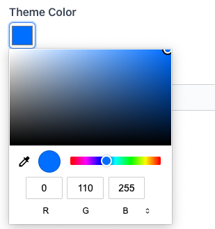

# Custom fields for Keystone.js

---

## vectorImage


1. You have to define two types of storage. One for raster images (of type 'image')
   and of for vector images (of type 'file'), but both of them **must use** the same directory for storage,
   in the following code snippet it's `/uploads`.

```typescript
// keystone.ts
{
  ...
  storage: {
    // JPG, JPEG, PNG etc.
    localRasterImages: {
      kind: 'local',
      type: 'image',
      storagePath: './uploads',
      serverRoute: {
        path: '/images',
      },
      generateUrl: (path) => `/images${path}`,
      preserve: false,
    },
    // SVG
    localVectorImages: {
      kind: 'local',
      type: 'file',
      storagePath: './uploads',
      serverRoute: {
        path: '/svg',
      },
      generateUrl: (path) => `/images${path}`,
      preserve: false,
    },
  },
  ...
}
```

2. Use it exactly the same way you would do with classic `image({...})` field:

```typescript
// models/User.ts

{
  ...
  avatar: vectorImage({
      storage: 'localVectorImages', // use previously created storage for verctor images
      // other options goes here
  }),
  ...
}
```

> #### How it works:
>
> `vectorImage` field behaves like standard image on front-end, but treated as `file` on back-end.

---

## colorPicker



> No extra configuration is needed.

1. Use it exactly the same way as any other field

```typescript
// models/Post.ts

{
    ...
    themeColor: colorPicker({
        // options goes here 
    }),
    ...
}
```
